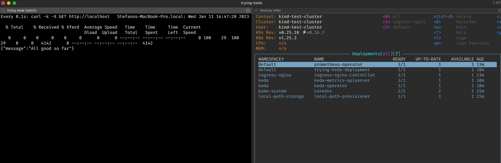

# Trying KEDA | Kubernetes Event-driven Autoscaling

Tiny lab for spyke purpose about  [`Keda`](https://keda.sh/) 

---
***Prerequisites:***
1. [`docker`](https://www.docker.com/): docker daemon for containerization purpose
2. [`kubectl`](https://kubernetes.io/docs/tasks/tools/): docker cli
3. [`minikube`](https://minikube.sigs.k8s.io/docs/): in order to apply against local [`kubernetes`](https://kubernetes.io/) environment
4. [`yq`](https://github.com/mikefarah/yq): [`yaml`](https://en.wikipedia.org/wiki/YAML) parser
5. [`jq`](https://stedolan.github.io/jq/download/)
---

The lab is composed by:
- [`prometheus`](https://prometheus.io/)
- Simple node application using  [`express`](https://www.npmjs.com/package/express) as rest srv along with [`express-prometheus-middleware`](https://www.npmjs.com/package/express-prometheus-middleware) for metrics
- [`keda`](https://keda.sh/) itself

**Main makefile targets:** 

Installing the whole stack
```bash
make install-all
```

Installing prometheus
```bash
make prometheus-install-all
```
Building, pushing and installing node app
```bash
make app-install-all
```

Installing `keda` as well as `ScaledObject` custom resource for node application deployment
```bash
make keda-install-all
```

Uninstalling the whole stack along with minikube cluster
```bash
make uninstall-all
```

## Install and test
```bash
make install-all
```

```bash
❯ make install-all
/Library/Developer/CommandLineTools/usr/bin/make \
	minikube-start \
	prometheus-install-all \
	app-install-all \
	keda-install-all
/usr/local/bin/minikube start
😄  minikube v1.26.0 on Darwin 11.3.1
🎉  minikube 1.28.0 is available! Download it: https://github.com/kubernetes/minikube/releases/tag/v1.28.0
💡  To disable this notice, run: 'minikube config set WantUpdateNotification false'

✨  Automatically selected the docker driver
📌  Using Docker Desktop driver with root privileges
👍  Starting control plane node minikube in cluster minikube
🚜  Pulling base image ...
🔥  Creating docker container (CPUs=2, Memory=4000MB) ...
🐳  Preparing Kubernetes v1.24.1 on Docker 20.10.17 ...
    ▪ Generating certificates and keys ...
    ▪ Booting up control plane ...
    ▪ Configuring RBAC rules ...
🔎  Verifying Kubernetes components...
    ▪ Using image gcr.io/k8s-minikube/storage-provisioner:v5
🌟  Enabled addons: storage-provisioner, default-storageclass
🏄  Done! kubectl is now configured to use "minikube" cluster and "default" namespace by default
/Library/Developer/CommandLineTools/usr/bin/make prometheus-operator-install \
	prometheus-rbac-install prometheus-install \
	wait_for_prom_operator_deploy \
	wait_for_prom_statefulset \
	wait_for_prom_pods \
	prometheus-svc-install \
	prometheus-service-monitor-install
/usr/local/bin/kubectl create -f https://raw.githubusercontent.com/prometheus-operator/prometheus-operator/master/bundle.yaml
customresourcedefinition.apiextensions.k8s.io/alertmanagerconfigs.monitoring.coreos.com created
customresourcedefinition.apiextensions.k8s.io/alertmanagers.monitoring.coreos.com created
customresourcedefinition.apiextensions.k8s.io/podmonitors.monitoring.coreos.com created
customresourcedefinition.apiextensions.k8s.io/probes.monitoring.coreos.com created
customresourcedefinition.apiextensions.k8s.io/prometheuses.monitoring.coreos.com created
customresourcedefinition.apiextensions.k8s.io/prometheusrules.monitoring.coreos.com created
customresourcedefinition.apiextensions.k8s.io/servicemonitors.monitoring.coreos.com created
customresourcedefinition.apiextensions.k8s.io/thanosrulers.monitoring.coreos.com created
clusterrolebinding.rbac.authorization.k8s.io/prometheus-operator created
clusterrole.rbac.authorization.k8s.io/prometheus-operator created
deployment.apps/prometheus-operator created
serviceaccount/prometheus-operator created
service/prometheus-operator created
/usr/local/bin/kubectl apply -n "default" -f prometheus/prom_rbac.yaml
serviceaccount/prometheus created
clusterrole.rbac.authorization.k8s.io/prometheus created
clusterrolebinding.rbac.authorization.k8s.io/prometheus created
/usr/local/bin/kubectl apply -n "default" -f prometheus/prometheus.yaml
prometheus.monitoring.coreos.com/prometheus created
/usr/local/bin/kubectl wait \
	deployment -n "default" \
	prometheus-operator \
	--for condition=Available=True \
	--timeout=300s
deployment.apps/prometheus-operator condition met
/usr/local/bin/kubectl rollout \
	-n "default" \
	status --watch --timeout=300s \
	statefulset/prometheus-prometheus
Waiting for 2 pods to be ready...
Waiting for 1 pods to be ready...
statefulset rolling update complete 2 pods at revision prometheus-prometheus-8bb4dfc77...
/usr/local/bin/kubectl wait \
	-n "default" \
	--for condition=ready \
	--timeout=300s \
	pod -l prometheus=prometheus
pod/prometheus-prometheus-0 condition met
pod/prometheus-prometheus-1 condition met
/usr/local/bin/kubectl apply -n "default" -f prometheus/prom_svc.yaml
service/prometheus created
/usr/local/bin/kubectl patch svc prometheus \
	-n "default" \
	--type=json -p='[{"op": "add", "path": "/spec/selector/prometheus", "value": "prometheus"}]'
service/prometheus patched
/usr/local/bin/kubectl patch svc prometheus \
	-n "default" \
	--type=json -p='[{"op": "remove", "path": "/spec/selector/app"}]'
service/prometheus patched
/usr/local/bin/kubectl apply -n "default" -f prometheus/prometheus_svc_monitor.yaml
servicemonitor.monitoring.coreos.com/prometheus-self created
/usr/local/bin/docker build \
	--build-arg BASE_IMAGE="node:18" \
	--build-arg APP_NAME=trying-keda \
	-t trying-keda:1.0.0 \
	--pull \
	--no-cache \
	-f ./src/Dockerfile \
	./src
[+] Building 20.3s (10/10) FINISHED
 => [internal] load build definition from Dockerfile                                                              0.0s
 => => transferring dockerfile: 228B                                                                              0.0s
 => [internal] load .dockerignore                                                                                 0.0s
 => => transferring context: 2B                                                                                   0.0s
 => [internal] load metadata for docker.io/library/node:18                                                        2.8s
 => [auth] library/node:pull token for registry-1.docker.io                                                       0.0s
 => [internal] load build context                                                                                 0.0s
 => => transferring context: 851B                                                                                 0.0s
 => [1/4] FROM docker.io/library/node:18@sha256:c47a2c61e635eb4938fcd56a1139b552300624b53e3eca06b5554a577f1842cf  0.0s
 => CACHED [2/4] WORKDIR /home/app                                                                                0.0s
 => [3/4] COPY index.js package.json ./                                                                           0.0s
 => [4/4] RUN npm install                                                                                        16.7s
 => exporting to image                                                                                            0.6s
 => => exporting layers                                                                                           0.6s
 => => writing image sha256:19ab2ea79957da48f8c7b44cf67f29d3f6a9f5e81df9fa6407f63d26bdeec539                      0.0s
 => => naming to docker.io/library/trying-keda:1.0.0                                                              0.0s

Use 'docker scan' to run Snyk tests against images to find vulnerabilities and learn how to fix them
/usr/local/bin/minikube image \
	load  trying-keda:1.0.0
/usr/local/bin/kubectl apply \
	-n "default" \
	-f ./app/deployment.yaml
deployment.apps/trying-keda-deployment created
/usr/local/bin/kubectl apply \
	-n "default" \
	-f ./app/service.yaml
service/trying-keda-service created
/usr/local/bin/kubectl wait \
	-n "default" \
	--for condition=ready \
	--timeout=300s \
	pod -l app=trying-keda
pod/trying-keda-deployment-65bd558559-khngv condition met
/usr/local/bin/kubectl apply \
	-n "default" \
	-f ./app/prometheus_svc_monitor.yaml
servicemonitor.monitoring.coreos.com/trying-keda-svc-monitor created
/Library/Developer/CommandLineTools/usr/bin/make \
	keda-install \
	wait_for_keda_operator_deploy \
	keda-update-app-scaled-object \
	keda-app-scaled-object-install
/usr/local/bin/kubectl apply \
	-f https://github.com/kedacore/keda/releases/download/v2.8.0/keda-2.8.0.yaml
namespace/keda created
customresourcedefinition.apiextensions.k8s.io/clustertriggerauthentications.keda.sh created
customresourcedefinition.apiextensions.k8s.io/scaledjobs.keda.sh created
customresourcedefinition.apiextensions.k8s.io/scaledobjects.keda.sh created
customresourcedefinition.apiextensions.k8s.io/triggerauthentications.keda.sh created
serviceaccount/keda-operator created
clusterrole.rbac.authorization.k8s.io/keda-external-metrics-reader created
clusterrole.rbac.authorization.k8s.io/keda-operator created
rolebinding.rbac.authorization.k8s.io/keda-auth-reader created
clusterrolebinding.rbac.authorization.k8s.io/keda-hpa-controller-external-metrics created
clusterrolebinding.rbac.authorization.k8s.io/keda-operator created
clusterrolebinding.rbac.authorization.k8s.io/keda-system-auth-delegator created
service/keda-metrics-apiserver created
deployment.apps/keda-metrics-apiserver created
deployment.apps/keda-operator created
apiservice.apiregistration.k8s.io/v1beta1.external.metrics.k8s.io created
/usr/local/bin/kubectl wait \
	deployment -n "keda" \
	keda-operator \
	--for condition=Available=True \
	--timeout=300s
deployment.apps/keda-operator condition met
./utils/updateScaledObject.sh
http://10.99.24.45:9090
/usr/local/bin/kubectl apply \
	-n "default" \
	-f ./app/scaled-object.yaml
scaledobject.keda.sh/prometheus-app-scaled-object created
```

**Once the whole stack has been installed run:**
```bash
watch -n 0.01 curl -k -X GET http://localhost:3000/
```
 

**In case we wish we can even have a look at the metric (i.e. `http_requests_total`) coming through:**
 

## Related docs
* [`Scaling deployments`](https://keda.sh/docs/2.8/concepts/scaling-deployments/)
* [`Prometheus operator`](https://grafana.com/docs/grafana-cloud/kubernetes-monitoring/prometheus/prometheus_operator/)
