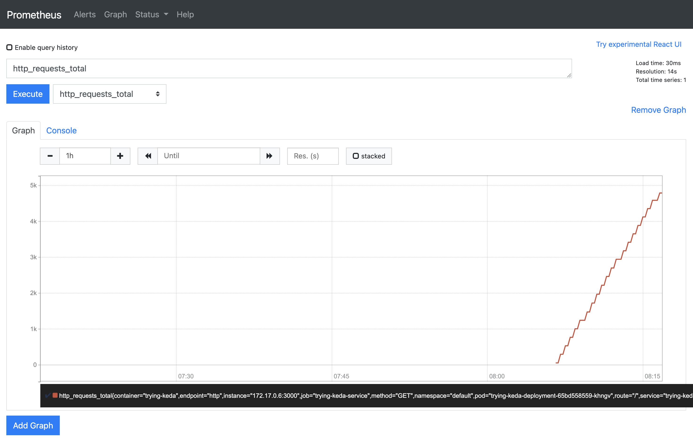

# Trying KEDA | Kubernetes Event-driven Autoscaling

Tiny lab for spyke purpose about  [`Keda`](https://keda.sh/) 

---
***Prerequisites:***
* [`docker`](https://www.docker.com/)
* [`kubectl`](https://kubernetes.io/docs/tasks/tools/)
* [`kind`](https://kind.sigs.k8s.io/)
* [`yq`](https://github.com/mikefarah/yq)
* [`jq`](https://stedolan.github.io/jq/download/)
---

The lab is composed by:
- [`prometheus`](https://prometheus.io/)
- simple node application using  [`express`](https://www.npmjs.com/package/express) as rest srv along with [`express-prometheus-middleware`](https://www.npmjs.com/package/express-prometheus-middleware) for metrics
- [`keda`](https://keda.sh/) itself

**Main makefile targets:** 

Installing the whole stack
```bash
make install_all
```

Installing prometheus
```bash
make prometheus_install_all
```
Building, pushing and installing node app
```bash
make app_install_all
```

Installing `keda` as well as `ScaledObject` custom resource for node application deployment
```bash
make keda_install_all
```

Uninstalling the whole stack along with minikube cluster
```bash
make uninstall_all
```
Delete clusters
```bash
make clean_up
```
```bash
make clean_up
/usr/local/bin/kind delete cluster --name test-cluster
Deleting cluster "test-cluster" ...
/usr/local/bin/kind delete cluster --name kind
Deleting cluster "kind" ...
```

## Install and test
```bash
make install_all
```

```bash
❯ make install_all
/Library/Developer/CommandLineTools/usr/bin/make \
	print_mk_var \
	cluster_start \
	create_cluster \
	set_context_cluster \
	cluster_info \
	config_installation \
	ingress_controller_install \
	wait_for_ingress_controller \
	prometheus_install_all \
	app_install_all \
	keda_install_all
YQ: [/usr/local/bin/yq]
JQ: [/usr/local/bin/jq]
KUBECTL: [/usr/local/bin/kubectl]
DOCKER: [/usr/local/bin/docker]
KIND: [/usr/local/bin/kind]
INFO_FILE: [./infra/info.yaml]
CLUSTER_NAME: [test-cluster]
DEFAULT_CLUSTER_NAME: [kind]
PROMETHEUS_NAMESPACE: [default]
KEDA_NAMESPACE: [keda]
APP_NAMESPACE: [default]
BASE_IMAGE: [node:18]
APP_NAME: [trying-keda]
IMAGE_NAME_TAG: [trying-keda:1.0.0]
ARTIFACT_REGISTRY: [ ]
FULLY_QUALIFIED_IMAGE_URL: [ trying-keda:1.0.0]
/usr/local/bin/kind create cluster
Creating cluster "kind" ...
 ✓ Ensuring node image (kindest/node:v1.25.3) 🖼
 ✓ Preparing nodes 📦
 ✓ Writing configuration 📜
 ✓ Starting control-plane 🕹️
 ✓ Installing CNI 🔌
 ✓ Installing StorageClass 💾
Set kubectl context to "kind-kind"
You can now use your cluster with:

kubectl cluster-info --context kind-kind

Not sure what to do next? 😅  Check out https://kind.sigs.k8s.io/docs/user/quick-start/
/usr/local/bin/kind create \
	cluster --config=infra/cluster.yaml \
	--name test-cluster
Creating cluster "test-cluster" ...
 ✓ Ensuring node image (kindest/node:v1.25.3) 🖼
 ✓ Preparing nodes 📦
 ✓ Writing configuration 📜
 ✓ Starting control-plane 🕹️
 ✓ Installing CNI 🔌
 ✓ Installing StorageClass 💾
Set kubectl context to "kind-test-cluster"
You can now use your cluster with:

kubectl cluster-info --context kind-test-cluster

Not sure what to do next? 😅  Check out https://kind.sigs.k8s.io/docs/user/quick-start/
/usr/local/bin/kubectl config set-context test-cluster
Context "test-cluster" modified.
/usr/local/bin/kubectl cluster-info --context kind-test-cluster
Kubernetes control plane is running at https://127.0.0.1:57272
CoreDNS is running at https://127.0.0.1:57272/api/v1/namespaces/kube-system/services/kube-dns:dns/proxy

To further debug and diagnose cluster problems, use 'kubectl cluster-info dump'.
./utils/configInstallation.sh "local"
registry.k8s.io/ingress-nginx/controller@sha256:4ba73c697770664c1e00e9f968de14e08f606ff961c76e5d7033a4a9c593c629: Pulling from ingress-nginx/controller
Digest: sha256:4ba73c697770664c1e00e9f968de14e08f606ff961c76e5d7033a4a9c593c629
Status: Image is up to date for registry.k8s.io/ingress-nginx/controller@sha256:4ba73c697770664c1e00e9f968de14e08f606ff961c76e5d7033a4a9c593c629
registry.k8s.io/ingress-nginx/controller:v1.5.1@sha256:4ba73c697770664c1e00e9f968de14e08f606ff961c76e5d7033a4a9c593c629
Image: "" with ID "sha256:f2e1146a6d96ac8eebb251284f45f8569f5879c6ec894ae1335d26617d36af2d" not yet present on node "test-cluster-control-plane", loading...
registry.k8s.io/ingress-nginx/kube-webhook-certgen@sha256:39c5b2e3310dc4264d638ad28d9d1d96c4cbb2b2dcfb52368fe4e3c63f61e10f: Pulling from ingress-nginx/kube-webhook-certgen
Digest: sha256:39c5b2e3310dc4264d638ad28d9d1d96c4cbb2b2dcfb52368fe4e3c63f61e10f
Status: Image is up to date for registry.k8s.io/ingress-nginx/kube-webhook-certgen@sha256:39c5b2e3310dc4264d638ad28d9d1d96c4cbb2b2dcfb52368fe4e3c63f61e10f
registry.k8s.io/ingress-nginx/kube-webhook-certgen:v20220916-gd32f8c343@sha256:39c5b2e3310dc4264d638ad28d9d1d96c4cbb2b2dcfb52368fe4e3c63f61e10f
Image: "" with ID "sha256:520347519a8caefcdff1c480be13cea37a66bccf517302949b569a654b0656b5" not yet present on node "test-cluster-control-plane", loading...
2.8.0: Pulling from kedacore/keda-metrics-apiserver
Digest: sha256:4afe231e9ce5ca351fcf10a83479eb0ee2f3e6dc0f386108b89d1b5623d56b14
Status: Image is up to date for ghcr.io/kedacore/keda-metrics-apiserver:2.8.0
ghcr.io/kedacore/keda-metrics-apiserver:2.8.0
Image: "" with ID "sha256:9d142dcd55a04476e5770c7d05959f88991d779bfddcf91842aaaac2e702cee6" not yet present on node "test-cluster-control-plane", loading...
2.8.0: Pulling from kedacore/keda
Digest: sha256:cce502ff17fd2984af70b4e470b403a82067929f6e4d1888875a52fcb33fa9fd
Status: Image is up to date for ghcr.io/kedacore/keda:2.8.0
ghcr.io/kedacore/keda:2.8.0
Image: "" with ID "sha256:c80625eea9c26f3091763b31f6a809c6b2dcff8b3b1acca0e18cf87554baa02a" not yet present on node "test-cluster-control-plane", loading...
v0.62.0: Pulling from prometheus-operator/prometheus-config-reloader
Digest: sha256:267b12235d10a810e49b2d40a3deda6256f92690b26997a199601a47283821b9
Status: Image is up to date for quay.io/prometheus-operator/prometheus-config-reloader:v0.62.0
quay.io/prometheus-operator/prometheus-config-reloader:v0.62.0
Image: "" with ID "sha256:e31159f5e80c825f145f9dd0473c506836b7b935809176954d38a4e381d97ad2" not yet present on node "test-cluster-control-plane", loading...
v0.62.0: Pulling from prometheus-operator/prometheus-operator
Digest: sha256:46fa26e75d8cb62197ab5fd26d09790cf31c30d04d7a04fcc4f7da4bd3f1714d
Status: Image is up to date for quay.io/prometheus-operator/prometheus-operator:v0.62.0
quay.io/prometheus-operator/prometheus-operator:v0.62.0
Image: "" with ID "sha256:9fe795595a1b39f3ceab212f95b47d28bc9c850cb6a80d093c9e8be7f11e11f7" not yet present on node "test-cluster-control-plane", loading...
v2.22.1: Pulling from prometheus/prometheus
Digest: sha256:b899dbd1b9017b9a379f76ce5b40eead01a62762c4f2057eacef945c3c22d210
Status: Image is up to date for quay.io/prometheus/prometheus:v2.22.1
quay.io/prometheus/prometheus:v2.22.1
Image: "" with ID "sha256:7cc97b58fb0e2e893684166bde28de583bedcdb4125fc4822c76b4e25c970707" not yet present on node "test-cluster-control-plane", loading...
/usr/local/bin/kubectl apply -f infra/ingress_controller.yaml
namespace/ingress-nginx created
serviceaccount/ingress-nginx created
serviceaccount/ingress-nginx-admission created
role.rbac.authorization.k8s.io/ingress-nginx created
role.rbac.authorization.k8s.io/ingress-nginx-admission created
clusterrole.rbac.authorization.k8s.io/ingress-nginx created
clusterrole.rbac.authorization.k8s.io/ingress-nginx-admission created
rolebinding.rbac.authorization.k8s.io/ingress-nginx created
rolebinding.rbac.authorization.k8s.io/ingress-nginx-admission created
clusterrolebinding.rbac.authorization.k8s.io/ingress-nginx created
clusterrolebinding.rbac.authorization.k8s.io/ingress-nginx-admission created
configmap/ingress-nginx-controller created
service/ingress-nginx-controller created
service/ingress-nginx-controller-admission created
deployment.apps/ingress-nginx-controller created
job.batch/ingress-nginx-admission-create created
job.batch/ingress-nginx-admission-patch created
ingressclass.networking.k8s.io/nginx created
validatingwebhookconfiguration.admissionregistration.k8s.io/ingress-nginx-admission created
/Library/Developer/CommandLineTools/usr/bin/make wait_for_ingress_controller
/usr/local/bin/kubectl wait \
	-n ingress-nginx \
  --for=condition=ready pod \
  --selector=app.kubernetes.io/component=controller \
  --timeout=90s
pod/ingress-nginx-controller-9d6dbdfc9-pvx4h condition met
/usr/local/bin/kubectl wait \
	-n ingress-nginx \
  --for=condition=ready pod \
  --selector=app.kubernetes.io/component=controller \
  --timeout=90s
pod/ingress-nginx-controller-9d6dbdfc9-pvx4h condition met
/Library/Developer/CommandLineTools/usr/bin/make \
	prometheus_operator_install \
	prometheus_rbac_install prometheus_install \
	wait_for_prom_operator_deploy \
	wait_for_prom_statefulset \
	wait_for_prom_pods \
	prometheus_svc_install \
	prometheus_service_monitor_install
/usr/local/bin/kubectl create -f ./prometheus/prometheus_operator.yaml
customresourcedefinition.apiextensions.k8s.io/alertmanagerconfigs.monitoring.coreos.com created
customresourcedefinition.apiextensions.k8s.io/alertmanagers.monitoring.coreos.com created
customresourcedefinition.apiextensions.k8s.io/podmonitors.monitoring.coreos.com created
customresourcedefinition.apiextensions.k8s.io/probes.monitoring.coreos.com created
customresourcedefinition.apiextensions.k8s.io/prometheuses.monitoring.coreos.com created
customresourcedefinition.apiextensions.k8s.io/prometheusrules.monitoring.coreos.com created
customresourcedefinition.apiextensions.k8s.io/servicemonitors.monitoring.coreos.com created
customresourcedefinition.apiextensions.k8s.io/thanosrulers.monitoring.coreos.com created
clusterrolebinding.rbac.authorization.k8s.io/prometheus-operator created
clusterrole.rbac.authorization.k8s.io/prometheus-operator created
deployment.apps/prometheus-operator created
serviceaccount/prometheus-operator created
service/prometheus-operator created
/usr/local/bin/kubectl apply \
	-n default \
	-f prometheus/prom_rbac.yaml
serviceaccount/prometheus created
clusterrole.rbac.authorization.k8s.io/prometheus created
clusterrolebinding.rbac.authorization.k8s.io/prometheus created
/usr/local/bin/kubectl apply \
	-n default \
	-f prometheus/prometheus.yaml
prometheus.monitoring.coreos.com/prometheus created
/usr/local/bin/kubectl wait \
	deployment -n default \
	prometheus-operator \
	--for condition=Available=True \
	--timeout=300s
deployment.apps/prometheus-operator condition met
/usr/local/bin/kubectl rollout \
	-n default \
	status --watch --timeout=300s \
	statefulset/prometheus-prometheus
Waiting for 2 pods to be ready...
Waiting for 1 pods to be ready...
statefulset rolling update complete 2 pods at revision prometheus-prometheus-76c88b4467...
/usr/local/bin/kubectl wait \
	-n default \
	--for condition=ready \
	--timeout=300s \
	pod -l prometheus=prometheus
pod/prometheus-prometheus-0 condition met
pod/prometheus-prometheus-1 condition met
/usr/local/bin/kubectl apply \
	-n default \
	-f prometheus/prom_svc.yaml
service/prometheus created
/usr/local/bin/kubectl patch svc prometheus \
	-n default \
	--type=json -p='[{"op": "add", "path": "/spec/selector/prometheus", "value": "prometheus"}]'
service/prometheus patched
/usr/local/bin/kubectl patch svc prometheus \
	-n default \
	--type=json -p='[{"op": "remove", "path": "/spec/selector/app"}]'
service/prometheus patched
/usr/local/bin/kubectl apply \
	-n default \
	-f prometheus/prometheus_svc_monitor.yaml
servicemonitor.monitoring.coreos.com/prometheus-self created
/Library/Developer/CommandLineTools/usr/bin/make \
	app_build \
	load_image \
	apply \
	wait_for_app_pods \
	prometheus_app_svc_monitor_install
/usr/local/bin/docker build \
	--build-arg BASE_IMAGE=node:18 \
	--build-arg APP_NAME=trying-keda \
	-t trying-keda:1.0.0 \
	--pull \
	--no-cache \
	-f ./src/Dockerfile \
	./src
[+] Building 14.3s (7/8)
 => [internal] load build definition from Dockerfile                                               0.0s
 => => transferring dockerfile: 37B                                                                0.0s
 => [internal] load .dockerignore                                                                  0.0s
 => => transferring context: 2B                                                                    0.0s
 => [internal] load metadata for docker.io/library/node:18                                         1.5s
 => [1/4] FROM docker.io/library/node:18@sha256:5ba5d1476b8b4f7eed76f5fee6a3a16fa13e87c358fd72b49 [+] Building 14.5s (7/8)                                                                                 resolve docker.io/library/node:18@sha256:5ba5d1476b8b4f7eed76f5fee6a3a16fa13e87c358fd72b49  => [internal] load build definition from Dockerfile                                               0.0sinternal] load build context                                                                  => => transferring dockerfile: 37B                                                                0.0s> transferring context: 62B                                                                   => [internal] load .dockerignore                                                                  0.0sACHED [2/4] WORKDIR /home/app                                                                 => => transferring context: 2B                                                                    0.0s3/4] COPY index.js package.json ./                                                            => [internal] load metadata for docker.io/library/node:18                                         1.5s4/4] RUN npm install                                                                          => [1/4] FROM docker.io/library/node:18@sha256:5ba5d1476b8b4f7eed76f5fee6a3a16fa13e87c358fd72b49 [+] Building 26.7s (9/9) FINISHED
 => [internal] load build definition from Dockerfile                                         0.0s  => => transferring dockerfile: 37B                                                          0.0s
 => [internal] load .dockerignore                                                            0.0s  => => transferring context: 2B                                                              0.0s
 => [internal] load metadata for docker.io/library/node:18                                   1.5s  => [1/4] FROM docker.io/library/node:18@sha256:5ba5d1476b8b4f7eed76f5fee6a3a16fa13e87c358f  0.0s
 => => resolve docker.io/library/node:18@sha256:5ba5d1476b8b4f7eed76f5fee6a3a16fa13e87c358f  0.0s  => [internal] load build context                                                            0.0s
 => => transferring context: 62B                                                             0.0s  => CACHED [2/4] WORKDIR /home/app                                                           0.0s
 => [3/4] COPY index.js package.json ./                                                      0.0s  => [4/4] RUN npm install                                                                   21.2s
 => exporting to image                                                                       3.9s
 => => exporting layers                                                                      3.9s
 => => writing image sha256:c75a4c3f751c44d1b44ff6d5f99e8000665a7948c11d14a40b5cf0ad42d9907  0.0s
 => => naming to docker.io/library/trying-keda:1.0.0                                         0.0s

Use 'docker scan' to run Snyk tests against images to find vulnerabilities and learn how to fix them
/usr/local/bin/kind load \
	docker-image  trying-keda:1.0.0 \
	--name test-cluster
Image: "" with ID "sha256:c75a4c3f751c44d1b44ff6d5f99e8000665a7948c11d14a40b5cf0ad42d99073" not yet present on node "test-cluster-control-plane", loading...
/usr/local/bin/kubectl apply \
	-n default \
	-f ./app/deployment.yaml
deployment.apps/trying-keda-deployment created
/usr/local/bin/kubectl apply \
	-n default \
	-f ./app/service.yaml
service/trying-keda-service created
/usr/local/bin/kubectl apply \
	-n default \
	-f ./app/ingress.yaml
ingress.networking.k8s.io/trying-keda-ingress created
/usr/local/bin/kubectl wait \
	-n default \
	--for condition=ready \
	--timeout=300s \
	pod -l app=trying-keda
pod/trying-keda-deployment-659d849bd8-w2nq8 condition met
/usr/local/bin/kubectl apply \
	-n default \
	-f ./app/prometheus_svc_monitor.yaml
servicemonitor.monitoring.coreos.com/trying-keda-svc-monitor created
/Library/Developer/CommandLineTools/usr/bin/make \
	keda_install \
	wait_for_keda_operator_deploy \
	keda_update_app_scaled_object \
	keda_app_scaled_object_install
/usr/local/bin/kubectl apply \
	-f ./keda/keda-2.8.0.yaml
namespace/keda created
customresourcedefinition.apiextensions.k8s.io/clustertriggerauthentications.keda.sh created
customresourcedefinition.apiextensions.k8s.io/scaledjobs.keda.sh created
customresourcedefinition.apiextensions.k8s.io/scaledobjects.keda.sh created
customresourcedefinition.apiextensions.k8s.io/triggerauthentications.keda.sh created
serviceaccount/keda-operator created
clusterrole.rbac.authorization.k8s.io/keda-external-metrics-reader created
clusterrole.rbac.authorization.k8s.io/keda-operator created
rolebinding.rbac.authorization.k8s.io/keda-auth-reader created
clusterrolebinding.rbac.authorization.k8s.io/keda-hpa-controller-external-metrics created
clusterrolebinding.rbac.authorization.k8s.io/keda-operator created
clusterrolebinding.rbac.authorization.k8s.io/keda-system-auth-delegator created
service/keda-metrics-apiserver created
deployment.apps/keda-metrics-apiserver created
deployment.apps/keda-operator created
apiservice.apiregistration.k8s.io/v1beta1.external.metrics.k8s.io created
/usr/local/bin/kubectl wait \
	deployment -n keda \
	keda-operator \
	--for condition=Available=True \
	--timeout=300s
deployment.apps/keda-operator condition met
./utils/updateScaledObject.sh
http://10.96.180.178:9090
/usr/local/bin/kubectl apply \
	-n default \
	-f ./app/scaled-object.yaml
scaledobject.keda.sh/prometheus-app-scaled-object created

```

**Once the whole stack has been installed run:**
```bash
watch -n 0.01 curl -k -X GET http://localhost
```
 

**In case we wish we can even have a look at the metric (i.e. `http_requests_total`) coming through:**
 

## Related docs
* [`Scaling deployments`](https://keda.sh/docs/2.8/concepts/scaling-deployments/)
* [`Prometheus operator`](https://grafana.com/docs/grafana-cloud/kubernetes-monitoring/prometheus/prometheus_operator/)
